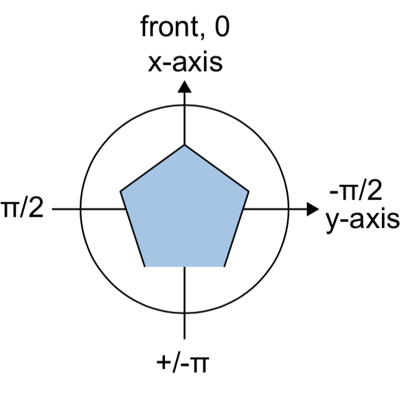

# Construction of virtual environments

## Definition of dimensions and orientation

### Defining spatial scale
The spatial scale of objects in unity directly affects how these objects behave if they are involved in physics simulations (presumably because their mass is derived from their scale?). For example, it takes more force to move a 1 m sphere compared to a 1 cm sphere and once the larger sphere moves it will move for longer.

Since we are not using  the unity physics engine to update positions of objects (at least not the virtual position of the fly -- see closed-loop position updates for details), the scale of worlds in unity doesn’t actually matter. Instead the scale can be imposed by the units of the ball radius, which is used to convert the ball rotation (reported in radians or “ticks”) to movements in the 2D plane.

The ball radius can be exposed as a variable in the unity editor (and later in a GUI).

### Definition of angles in cylinder worlds

## Customize distant features
### Simulation of a fixed panorama using a background cylinder
This option is used for generating a 1D cylinder panorama where different images can be loaded in at run time.
* Install the Janelia Unity Toolkit package “Background”
* Go to Window → Set Up Background Cylinder.
* In the popup window, select the radius and height of the cylinder and choose a game object to tether it to (should be “Fly”).
* Press update.
There is an ipython notebook for generating panorama textures (generatePanoramas.ipynb in https://github.com/hjmh/vrStim). This notebook also gives instructions for how to set the radius and height for the virtual cylinder to make sure the texture is not distorted.

### Receptive field mapping procedure
* Use background cylinder with texture for receptive field mapping (single small feature)
* Add script to background cylinder which remaps the texture and logs the remapping steps
* Add additional constraint to make sure the cylinder does not only move with the fly but also rotates (reorients) with the fly. To do this, select the background cylinder object, in the inspector → add component → Rotation Constraint. Select the Fly object as the constraint source.

### Customize skybox (optional)
**Option 1**: Use the built-in skybox, which comes with a brightness gradient and a sun spot. You can customize the sun spot by varying the rotation of the directional light which is coupled to the sky box.

**Option 2**: To generate a flat solid background, you can simply change the Camera setting “Clear Flags” from “Skybox” to “Solid color”. To do this, select the main camera object and go to the “Camera” tab in the Inspector panel. Note that this creates different lighting settings than when a flat background is generated with a custom flat skybox.

**Option 3**: Load a custom skybox. This allows for the highest degree of control.
For this approach, one needs to first create 6 textures that form a cube map of the sky. Philip Hubbard wrote a python script that allows rendering such cube maps with the Nishita model in Blender (2.9 or higher).

* To create a new skybox material:
- In the menu bar navigate to Assets → Create → Material. You should rename it and move it into a new folder in Assets called “Materials”.
- In the Shader drop-down, click Skybox, then the skybox Shader you want to use (6-sided).
- You can now fill out the properties on the Material to set up the skybox. The properties on the material depend on the skybox shader the material uses. For the 6-sided skybox, you have to map 6 texture images to the 6 sides.
-The mapping works as follows
+ for gradients: +z:yNeg, -z:yPos, +x: xNeg, -x:xPos, +y:zPos, -y:zPos
+ for sun disks: +z:xNeg, -z:xPos, +x: yNeg, -x:yPos, +y:zPos, -y:zPos
-See below for how to generate skybox textures. Place these textures into a new folder called “Textures” in the Assets folder.
-For each of the image textures, set Wrap Mode in the inspector window to “Clamp” to avoid black lines in the rendered world

* Go to Window → Rendering → Lighting to open the lighting window
* In the Environment tab you can select your skybox of choice.
* Adjust directional lighting (see below)

See also: https://docs.unity3d.com/560/Documentation/Manual/HOWTO-UseSkybox.html

Make a custom skybox texture with Blender
1. Skybox from blender scene: You can generate a Blender scene and then take 6 images to generate a cube map from inside this scene. This approach makes it possible to make a skybox that mimics the simulated 1D scene with a background cylinder.

Scripts for generating the cube maps in Blender can be found here: https://github.com/JaneliaSciComp/blender-spherical-video

​​Navigate to the cloned repo and use the following command:
> blender-spherical-video haberkernh$ Blender --background --python blender-spherical-video/sphericalVideo.py -- -i <pathToBlenderWorld> -o <directoryWhereToSaveImages>

2. Naturalistic skybox using models implemented in Blender: ….
