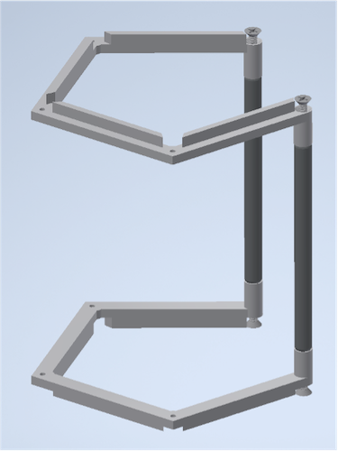
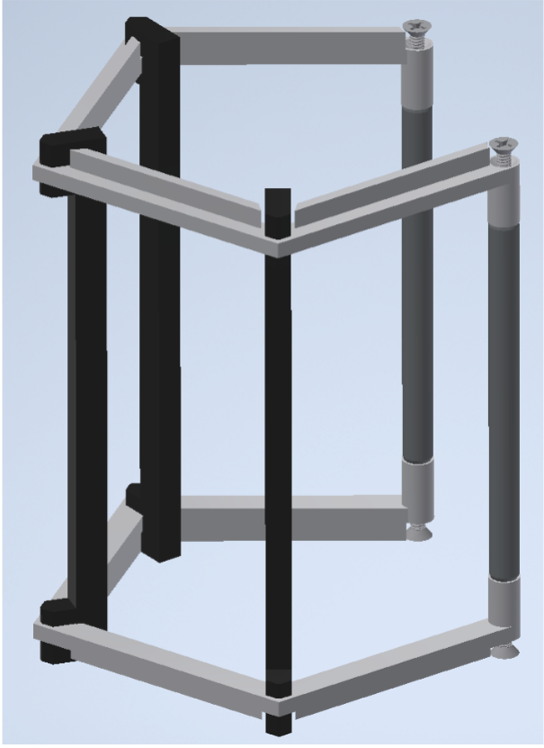
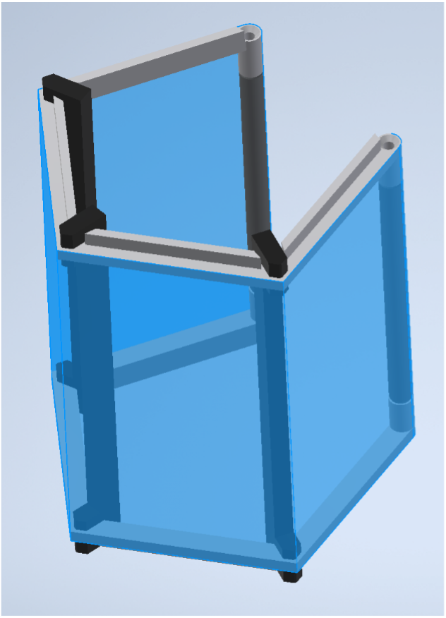
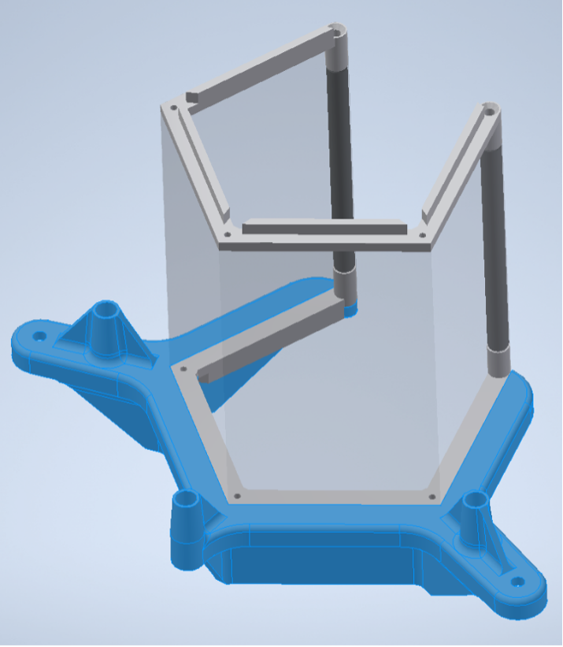
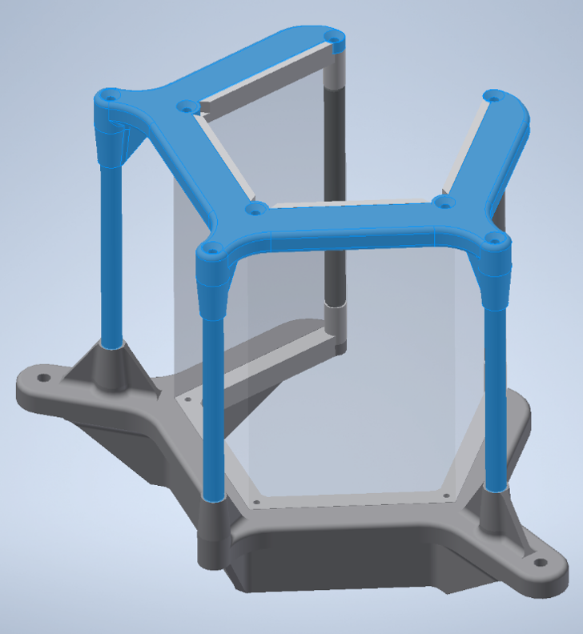

# Projector-based display

## Pentagonal display for four projectors

### Parts:
**Commercial parts**
* 5x thorlabs MS3R posts https://www.thorlabs.com/thorproduct.cfm?partnumber=MS3R
*	10x 0.75in #4-40 flat head screws https://www.mcmaster.com/91500A308/  
*	6x 0.1875in #4-40 flat head screws https://www.mcmaster.com/91500A120/
*	1x precut screen sheet with at least 1/8in extra height and 1in length to trim after assembly
*	Screen material, Item # V-H105-CV07 https://www.brightviewtechnologies.com/products/all-products/volumetric-diffusers

**3D printed parts**
*	2x 3d printed WIDE SCREEN HOLDER parts with holes tapped for 4-40 thread
*	3x SCREEN ASSEMBLY GUIDE parts(printed or lasercut)
*	1x Bottom Screen Support Frame
*	1x Top Screen Support Frame

### Assembly
1. Assemble the wide screen holders and 2 thorlabs MSR3 posts with the 4-40 screws.

2. Re-enforce the assembly with the screen assembly guides (slip fit, no glue).

3. Pre-crease the screen and carefully to align it to the frame. Use superglue to adhere the centermost fold to the frame top and bottom being careful to maintain tension and alignment. Once dry glue from the center out around the frame again being careful with alignment to prevent bowing or wrinkles. Clamping can be aided with binder clips.

4. After everything has dried, remove the assembly guides, trim the screen flush top and bottom and screw this sub assembly into the Bottom Screen Support Frame with 3 #4-40 0.1875" screws.

5. Place the top screen support and remaining posts and screw down with remaining #4-40 screws (0.3125in into screen frame, 0.75in into the thorlabs posts.

